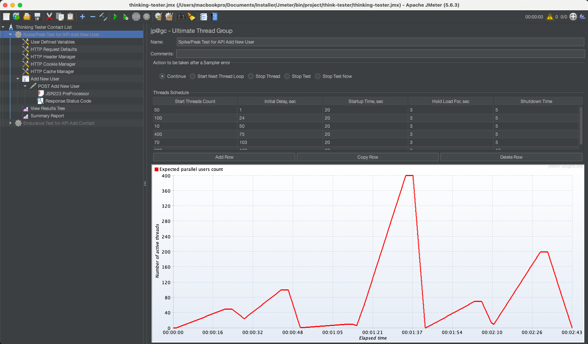
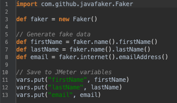
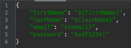
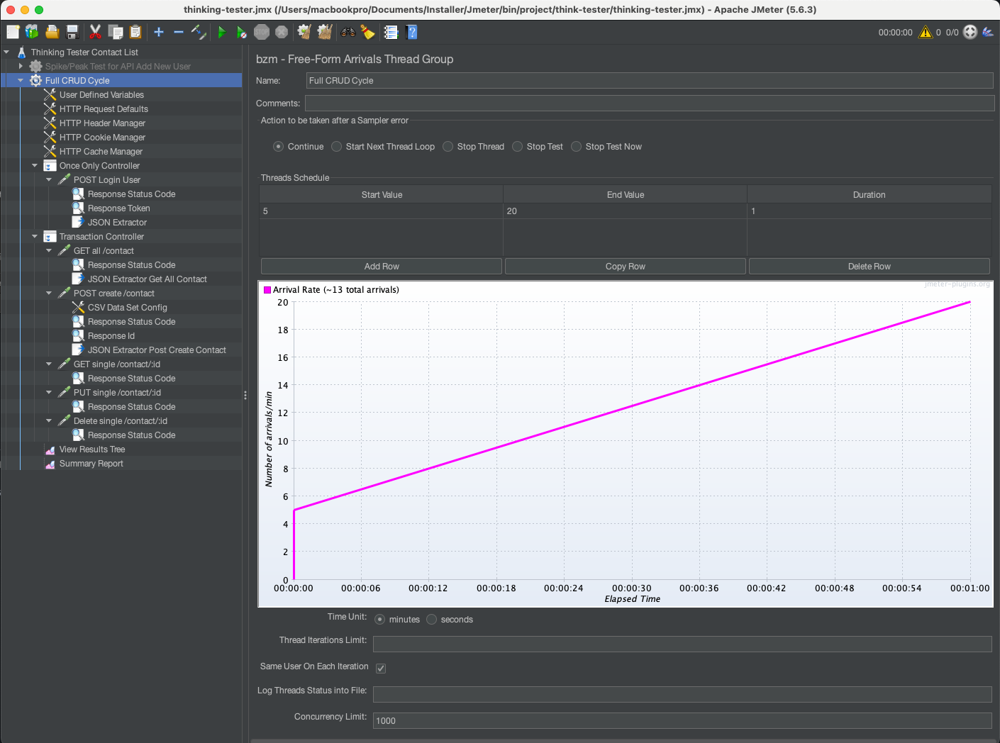
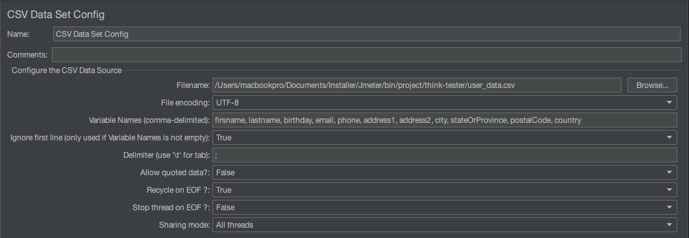
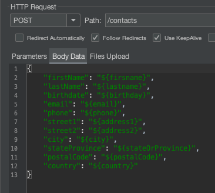

# performance-test-thinking-tester

This repository presents a demonstration of performance testing on the public API:
👉 https://thinking-tester-contact-list.herokuapp.com

The tests simulate two distinct performance scenarios:

1. Spike Testing – to evaluate sudden load surges
2. Endurance Testing – to assess stability over time

For full configuration and thread setup details, refer to the thinking-tester.jmx file.

### 1. Spike Testing

- The primary objective of the spike test is to assess the robustness, scalability, and stability of the Add New User endpoint under extreme and sudden bursts of user traffic. This test simulates a real-world scenario where a large number of users attempt to register simultaneously or in rapid succession.

  

  ##### Load Pattern Example:

- To generate realistic input data for each request, the test uses the Faker library to dynamically create random user information for account registration.

  
  

  ##### Faker Setup in JMeter:

  ✅ Step-by-Step: Use Faker in JMeter

  1. Download java-faker JAR
     • Go to: [java faker](https://mvnrepository.com/artifact/com.github.javafaker/javafaker)
     • Download the latest .jar file (e.g., javafaker-1.0.2.jar)

  2. Add the JAR to JMeter
     • Put the .jar file in:
     ➤ JMETER_HOME/lib/ext/
     • Restart JMeter if it was open.

  ✅ Add snakeyaml JAR Manually

  1. Download snakeyaml JAR
     Go to: 👉 [snakeyaml](https://mvnrepository.com/artifact/org.yaml/snakeyaml)
     Download a compatible version — e.g., snakeyaml-1.33.jar

  2. Put the JAR in JMeter
     Copy the downloaded snakeyaml-\*.jar file to:
     <JMeter_Home>/lib/
     ⚠️ Do not put it in lib/ext (only for plugins or samplers).
  3. Restart JMeter

  ##### Final Result

  - Detailed Report (Google Docs):
    [spike testing](https://docs.google.com/document/d/1C09nJfPTX41WZpn9WqVmDjv4LALlApLvZ_Zdwlsmx_o/edit?usp=sharing)
  - Test Execution Video:
    [video](https://drive.google.com/file/d/19yKuMddfEVDe83eAAhOSdBUPGZtfOaOS/view?usp=sharing)

### 2. Endurance Testing

- The primary goal of this test is to evaluate the functional integrity and performance stability of the public API at https://thinking-tester-contact-list.herokuapp.com when executing a complete Create, Read, Update, Delete (CRUD) cycle. This test mimics realistic user behavior by performing all major operations within a single user session.

  
  
  

  ##### Final Result

  - Detailed Report (Google Docs):
    [endurance testing](https://docs.google.com/document/d/1mBQN_sat-BLpjQjXpq0tleaIOgKfHoIKeJ5KQmqFDME/edit?usp=sharing)
  - Test Execution Video:
    [video](https://drive.google.com/file/d/1KQJPE3_8MsFCuMP_1UR8DNn8yjHDQAkA/view?usp=sharing)
